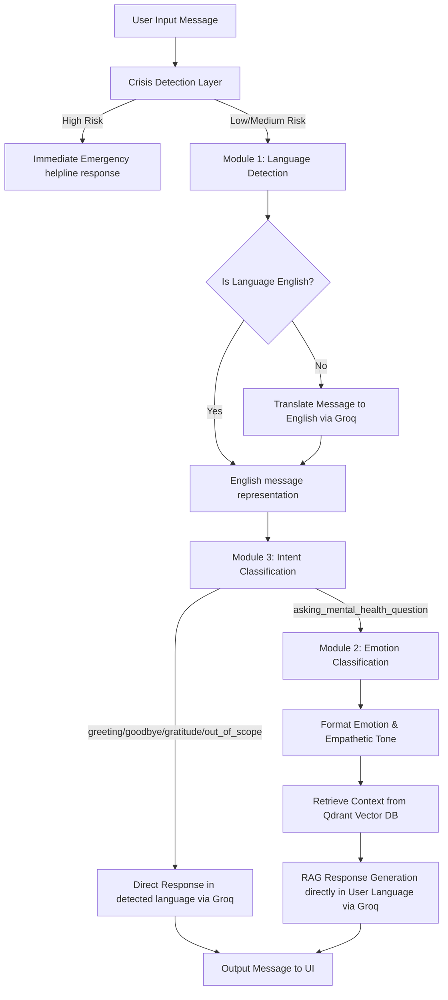

# 🧠 MindBot — RAG-Based Mental Health Support Chatbot
### NLP Final Project 2026

MindBot is a production-ready, end-to-end mental health chatbot integrating **4 NLP modules** into a single pipeline. It features an interactive, highly-responsive Streamlit UI (with live analytics) and a FastAPI REST API backend. 

The chatbot utilizes an auto-detect translation pipeline that dynamically detects the user's input language, processes the request internally using semantic models (Qdrant & DistilBERT), and directly replies in the exact language the user queried with—ensuring seamless native conversations without double-translation errors.

---

## 🌟 Key Features
* 🆘 **Crisis Detection (Override Layer)**: Real-time keyword scanning that immediately detects high-risk expressions, overrides pipeline routing, and outputs local emergency hotlines.
* 🌍 **Auto-Detect Multi-Language Support**: Dynamically detects the user's language (via a layered Unicode/TF-IDF/langdetect engine) and replies natively.
* ⚡ **Plug-and-Play Cloud Fallbacks**: Seamless fallback handling for language detection (`langdetect`) and emotion classification (HuggingFace Hub) for zero-config deployment on platforms like Streamlit Cloud.
* 💬 **Contextual Turn Memory**: Tracks the last 10 turns of conversation history and appends them to the Qdrant retrieval search query for context-aware counseling responses.
* 📊 **Interactive Session Analytics**: Real-time Plotly charts detailing emotion timelines, dominant emotion frequencies, intent distributions, and response speed over the course of the session.
* 💾 **JSON Session Export**: Export the complete conversation history directly as a downloadable JSON file for offline record-keeping.

---

## ⚙️ Tech Stack
* **Traditional Machine Learning**: scikit-learn (TF-IDF char n-grams + LinearSVC) for fast, low-footprint language detection.
* **Deep Learning**: PyTorch + Hugging Face Transformers (`distilbert-base-uncased-emotion` sequence classification).
* **Embeddings**: sentence-transformers (`BAAI/bge-base-en-v1.5`, 768-dim, normalized Cosine distance).
* **Vector Store**: Qdrant Cloud.
* **Large Language Models (LLM)**: Groq API (`openai/gpt-oss-120b` for full RAG synthesis and `openai/gpt-oss-20b` for few-shot intent routing and translation).
* **UI & API layers**: Streamlit 1.35+ and FastAPI (Uvicorn).
* **Hardware Acceleration**: Auto-detects and prioritizes **MPS** (Apple Silicon) or **CUDA** (NVIDIA GPUs) for deep learning inference.

---

## 📐 Architecture & Pipeline Flow
The following diagram describes the end-to-end pipeline processing:



---

## 📂 Project Structure
```
NLP_Final_Project/
│
├── notebooks/
│   ├── 01_language_detection.ipynb    ← Module 1: TF-IDF + LinearSVC Notebook
│   ├── 02_emotion_classifier.ipynb    ← Module 2: DistilBERT Training Notebook
│   ├── 03_intent_classifier.ipynb     ← Module 3: Few-shot Prompting Notebook
│   └── 04_rag_pipeline.ipynb          ← Module 4: Qdrant Retrieval and RAG Notebook
│
├── src/
│   ├── modules/
│   │   ├── language_detector.py       ← M1: layered Unicode/TF-IDF detector
│   │   ├── emotion_classifier.py      ← M2: MPS-accelerated DistilBERT classifier
│   │   ├── intent_classifier.py       ← M3: Groq few-shot intent parser
│   │   └── rag_pipeline.py            ← M4: Qdrant query, retrieval, and RAG execution
│   │
│   ├── pipeline/
│   │   └── chat_engine.py             ← Main orchestrator containing session state
│   │
│   └── utils/
│       ├── preprocessing.py           ← Text scrubbing and cleaning utilities
│       └── crisis_detector.py         ← Crisis keyword matcher and hotline output
│
├── app/
│   └── streamlit_app.py               ← Premium UI & Plotly analytics dashboard
│
├── api/
│   └── server.py                      ← FastAPI REST endpoint and schemas
│
├── scripts/
│   ├── train_language_model.py        ← Script to train M1 and save pickle
│   ├── train_emotion_model.py         ← Script to train/download M2 locally
│   └── ingest_rag.py                  ← Script to load dataset and ingest Qdrant
│
├── data/                              ← Training datasets (Ignored in Git)
├── models/                            ← Serialized model weights (Ignored in Git)
├── requirements.txt                   ← Dependencies listing
├── .env.example                       ← Environment variable template
└── .gitignore                         ← Strict repository ignore filter
```

---

## 🛢️ Qdrant Payload Schema
Data ingested into Qdrant follows this payload configuration:
* `context`: Original patient question text.
* `response`: Ground-truth counselor response text.
* `chunk`: Clean text segment used for embeddings.
* `chunk_idx`: Position index within the source document.
* `total_chunks`: Total segments divided from the document.
* `source_row_id`: Dataset source row number.

---

## 🔑 Environment Variables
Copy `.env.example` to `.env` in the root directory:
```bash
cp .env.example .env
```

Define the following keys in your `.env` file:

| Variable | Description | Example / Required |
|----------|-------------|-------------------|
| `GROQ_API_KEY` | API key from console.groq.com | Required (starts with `gsk_`) |
| `QDRANT_URL` | Vector DB Cluster HTTPS endpoint URL | Required (from cloud.qdrant.io) |
| `QDRANT_API_KEY` | Database read/write API authorization key | Required |
| `LLM_API_KEY` | Alias for GROQ_API_KEY | Optional fallback |

---

## 🛠️ Prerequisites
* Python 3.9 to 3.13.
* PyTorch-compatible platform (macOS with Metal Core/MPS, Linux with CUDA, or basic CPU).
* Free accounts on **Groq Cloud** and **Qdrant Cloud**.

---

## 🚀 Getting Started

### 1. Install Dependencies
```bash
pip install -r requirements.txt
```

### 2. Run Module Training (Optional)
If running locally, you can train/cache the local weights files:
```bash
# Train M1 (Language Detector)
python scripts/train_language_model.py

# Download/Fine-tune M2 (Emotion Classifier)
python scripts/train_emotion_model.py
```
*(If local models are not trained/cached, the application automatically uses the Hugging Face Hub/langdetect cloud fallback layers).*

### 3. Ingest Data into Qdrant Cloud (One-time Setup)
Ingest the counseling conversations dataset into your remote Qdrant database:
```bash
python scripts/ingest_rag.py
```

### 4. Start the Application
To run the Streamlit user interface:
```bash
streamlit run app/streamlit_app.py
```
To run the FastAPI server:
```bash
uvicorn api.server:app --host 0.0.0.0 --port 8000 --reload
```
Access the interactive API Swagger docs at `http://localhost:8000/docs`.

---

## 🧪 Testing & Evaluation
Verify components, integrations, and session storage logic using the automated test suite.
```bash
python3 tests/test_suite.py
```
The test suite performs **44 assertions** covering:
1. Preprocessing and scrubbing utilities.
2. Crisis override levels (High, Medium, Low thresholds).
3. Intent routing (greeting, goodbye, out-of-scope, mental health).
4. Qdrant connection and vector retrieval scores.
5. End-to-end Chat Engine pipeline execution and session history memory.

---

## ☁️ Streamlit Community Cloud Deployment
To host MindBot online:

1. Push your code to your GitHub repository (ensuring `.env` and `models/` are ignored).
2. Log into [share.streamlit.io](https://share.streamlit.io/) using your GitHub account.
3. Click **"New app"**, then select:
   * **Repository**: `your-github-username/nlp-mental-health-chatbot-2026`
   * **Branch**: `main`
   * **Main file path**: `app/streamlit_app.py`
4. Click **"Advanced settings..."** at the bottom of the page.
5. Under **Secrets (TOML format)**, paste your keys:
   ```toml
   GROQ_API_KEY = "gsk_your_groq_api_key"
   QDRANT_URL = "https://your-cluster-endpoint.qdrant.io"
   QDRANT_API_KEY = "your_qdrant_api_key"
   ```
6. Click **"Save"**, and then select **"Deploy!"**. The container will boot up, automatically load modules via the Hugging Face/langdetect cloud fallback layer, and run without crashes.

---

## 🔍 Troubleshooting
* **Qdrant Read/Write Timeouts**: We have set the default client timeout to `60.0` seconds to prevent connection drops on Qdrant free-tier endpoints during initial cold-starts.
* **Double-Translation / English Response to Native Input**: We resolve this by having the RAG prompt (`RESPOND IN: [language]`) instruct the LLM to output directly in the auto-detected language. We bypass the final `_translate` step for active LLM generation, only using it as a fallback for hardcoded English greetings.
* **Model Weight Pathing Issues**: If the application throws pathing errors, ensure that your `.env` contains the correct paths, or delete local folders inside `models/` to force the app to stream weights via the cloud fallback layer.
